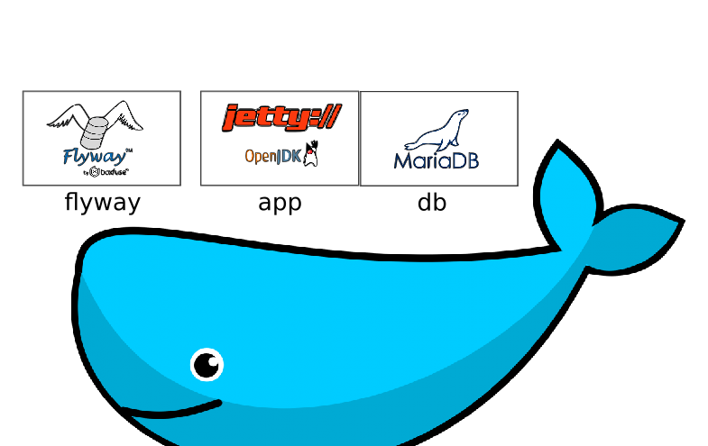

## Introducción

En esta serie tutorial veremos cómo instalar [docker](https://www.docker.com/), [docker-compose](https://docs.docker.com/compose/) y [docker-machine](https://docs.docker.com/machine/), y cómo usarlos para poner en producción en Digital Ocean una aplicación hecha en Java que usa MySQL.

Al finalizar, tendremos la siguiente arquitectura:

* Una aplicación web Java, corriendo sobre Jetty con la OpenJDK 8.
* Una base de datos MariaDB.
* Un proceso que ejecuta las migraciones de la base datos, utilizando FlywayDB.

Elegí aprovechar al máximo las capacidades de `docker-compose`, y por lo tanto solo la aplicación tiene su `Dockerfile`. Para el resto, opté por utilizar imágenes existentes, personalizando la configuración a través de las variables de entorno que estas proveían.

El tutorial está dividido en tres etapas:
1. [Instalación de `docker`, `docker-compose` y `docker-machine`.](1-instalacion.md)
1. [Creación de la imagen de la aplicación y del entorno para su ejecución.](2-configuracion.md)
1. [Publicación de la aplicación a DigitalOcean.](3-publicacion.md)

## Créditos

Toda la documentación que utilicé para crear este tutorial está linkeada en cada paso. Me inspiré además en las siguientes publicaciones:
* [un tutorial de CD con Heroku, Travis y Docker](https://medium.com/@javierfernandes/continuous-deployment-con-docker-travis-heroku-c24042fb830b), escrito por el colega docente y programador Javier Fernándes;
* https://medium.com/containers-101/using-docker-from-maven-and-maven-from-docker-1494238f1cf6
* http://geekyplatypus.com/packaging-and-serving-your-java-application-with-docker/
* https://www.digitalocean.com/community/tutorials/how-to-provision-and-manage-remote-docker-hosts-with-docker-machine-on-ubuntu-16-04
